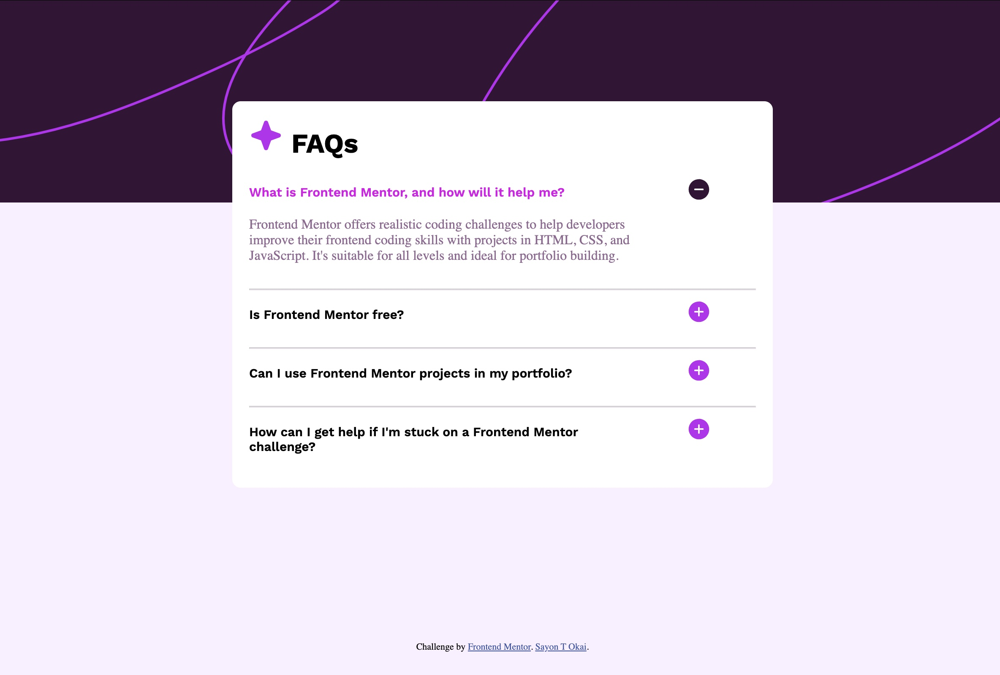

# Frontend Mentor - FAQ accordion solution

This is a solution to the [FAQ accordion challenge on Frontend Mentor](https://www.frontendmentor.io/challenges/faq-accordion-wyfFdeBwBz). Frontend Mentor challenges help you improve your coding skills by building realistic projects. 

## Table of contents

- [Overview](#overview)
  - [The challenge](#the-challenge)
  - [Screenshot](#screenshot)
- [My process](#my-process)
  - [Built with](#built-with)
  - [What I learned](#what-i-learned)
- [Author](#author)


**Note: Delete this note and update the table of contents based on what sections you keep.**

## Overview

### The challenge

Users should be able to:

- Hide/Show the answer to a question when the question is clicked
- Navigate the questions and hide/show answers using keyboard navigation alone
- View the optimal layout for the interface depending on their device's screen size
- See hover and focus states for all interactive elements on the page

### Screenshot




### Links

- Solution URL: [Add solution URL here](https://your-solution-url.com)
- Live Site URL: [Add live site URL here](https://sayon-okai.github.io/faq-accordion-main/)

## My process

### Built with

- Semantic HTML5 markup
- CSS custom properties
- CSS Grid
- Mobile-first workflow
- [jQuery](https://jquery.com/) - JS library


### What I learned

I was able to use jquery to add interactivity to project using click handler 
and other jquery method 


```js
 $(".icons").click(function () {
      var faqAnswer = $(this).next("p");
      faqAnswer.toggleClass("hidden")
      

      if (faqAnswer.hasClass("hidden")) {
          $(this).attr("src", "./assets/images/icon-plus.svg");
  
          $(this).prev("h3").css("color", "")
          
         
      } else {
          $(this).attr("src", "./assets/images/icon-minus.svg");
         
          $(this).prev("h3").css("color", "hsl(293, 88%, 47%)")
              faqAnswer.addClass("fade-text");
      }

      
   
});
```

## Author

- Frontend Mentor - [Sayon-okai](https://www.frontendmentor.io/profile/Sayon-okai)
- GitHub - [Sayon-okai](https://github.com/Sayon-okai)


